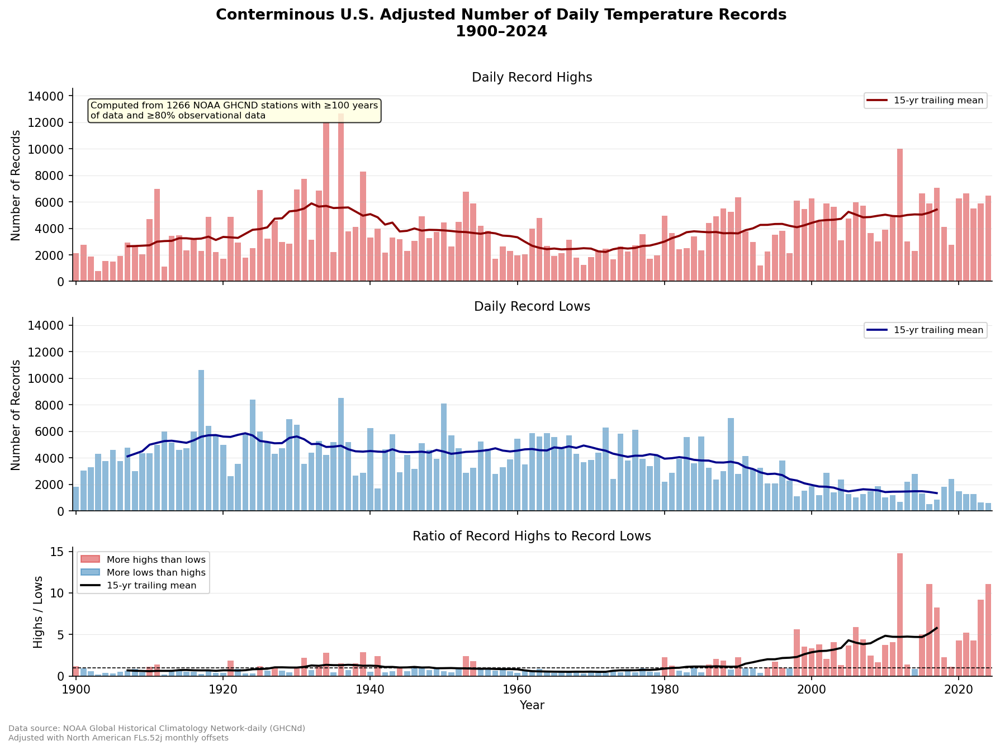
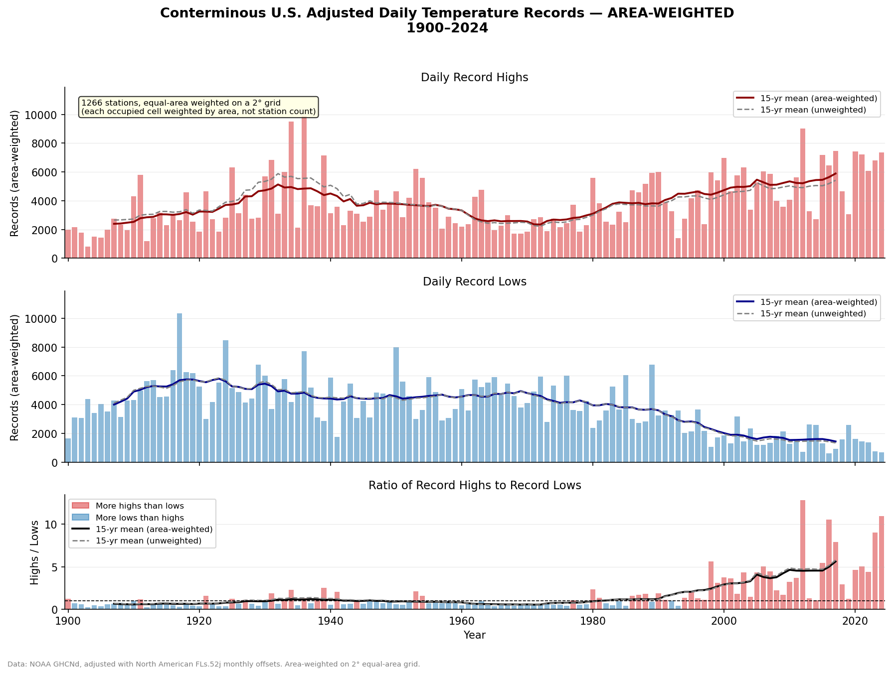
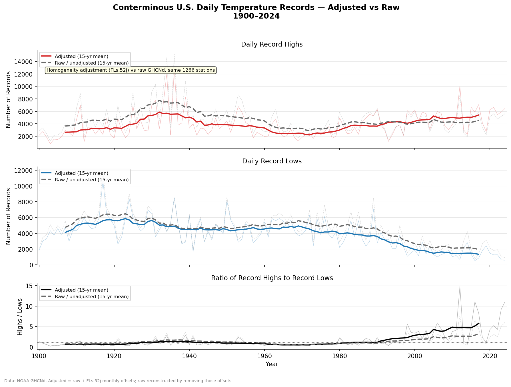

# U.S. Daily Temperature Records — Adjusted Data

Calculates time series of number of temperature records in CONUS using **homogeneity-adjusted** GHCN daily data rather than raw observations.

## What it produces

Three-panel figure (`adjusted_records.png`) and a CSV of annual counts (`adjusted_records.csv`):

1. **Daily Record Highs** — number of station–day combinations that set an all-time TMAX record in each year
2. **Daily Record Lows** — same for all-time TMIN records
3. **Ratio of Highs to Lows** — values > 1 indicate more record-breaking heat than cold



Additional outputs:

| File | Produced by | Description |
|------|-------------|-------------|
| `station_map.png` | `plot_station_map.py` | Cartopy map of the stations used in the figure |
| `good_stations.csv` | `station_density.py` | Station IDs and lat/lon of the stations used |
| `adjusted_records_areaweighted.png` | `compute_area_weighted.py` + `replot_areaweighted.py` | Equal-area-weighted version of the three-panel figure (see [Spatial weighting](#spatial-weighting)) |
| `adjusted_vs_raw_records.png` | `compute_raw_records.py` + `replot_raw_vs_adjusted.py` | Adjusted vs raw/unadjusted comparison (see [Effect of the homogeneity adjustment](#effect-of-the-homogeneity-adjustment)) |

## Data sources

| Data | Path |
|------|------|
| raw GHCND daily observations (by year) | `https://www.ncei.noaa.gov/data/north-american-dataset/access/` |
| Monthly FLs.52j adjustment offsets | see below |
| Station metadata | Downloaded at runtime from NOAA NCEI |

The adjustment is derived from monthly data and applied as:

```
adjusted_temp = raw_temp_C + monthly_offset_C
```

where the same offset is applied to all days within a calendar month. The `monthly_offsets.nc` file is produced by a companion repository: [aedessler/GHCN-monthly-offsets](https://github.com/aedessler/GHCN-monthly-offsets).

## Station selection

Matches the methodology of the original figure:
- **CONUS only**: latitude 24.5–49.5°N, longitude −125 to −66°W
- **≥100 years** of TMAX and TMIN data within the 1900–2024 study period
- **≥80%** of all possible station-days have valid, unflagged observations

This yields **1,266 stations**. (The stations actually used are not stored in `records_cache.npz`, which holds only the annual totals; they are recovered by re-applying the completeness filter to the checkpoint memmaps — see `plot_station_map.py` and `station_density.py`.)


## Record definition

For each station × calendar day-of-year pair, the year with the **highest adjusted TMAX** across all years receives one record high, and the year with the **lowest adjusted TMIN** receives one record low. Ties are counted in all tied years. Each station–DOY pair contributes at most ~1 record per type per year, so the expected count in any given year ≈ (N stations × 365) / N years ≈ 2,000.

## Spatial weighting

The GHCNd network is much denser in the eastern U.S. than the west: 68% of the 1,266 stations lie east of 100°W, although the west is roughly half of CONUS by area. Because the main figure **sums** record-setting station-days nationally, the totals are weighted toward eastern climate.

`compute_area_weighted.py` re-aggregates the records on an equal-area grid to remove this bias: each station is weighted by `cos(lat) / (stations in its 2° cell)`, normalized to mean 1, so every occupied grid cell contributes in proportion to its **area** rather than its station count. The unweighted recompute reproduces `records_cache.npz` exactly as a check.

**Result:** area-weighting barely changes the curves — but it reduces records in the 1930s and raises them in the last 10 years enough to make the last decade have, on average, more extreme temperatures.



## Effect of the homogeneity adjustment

To gauge how much the FLs.52j adjustment matters, `compute_raw_records.py` reconstructs the **raw** (unadjusted) temperatures from the adjusted checkpoints — `raw = round((adjusted − monthly_offset) × 10) / 10`, which is bit-exact because raw temps are whole tenths of a degree — and recomputes records on the same 1,266 stations (an additive offset does not change data availability). `replot_raw_vs_adjusted.py` overlays the two.

**Result:** unlike spatial weighting, the adjustment is a first-order effect on the ratio. It lowers the early-century ratio and roughly doubles the recent one (1900–1929: raw ≈ 0.82 vs adjusted ≈ 0.67; 2010–2024: raw ≈ 3.2 vs adjusted ≈ 5.8), steepening the shift from more record lows to more record highs. This is consistent with the adjustment removing time-of-observation bias, station moves, and the 1980s MMTS instrument transition. (Raw shows *more* total records because whole-tenths temperatures tie often and each tie counts in every tied year; the ratio cancels this out.)



## Usage

```bash
python compute_adjusted_records.py    # reads year files -> records_cache.npz (slow)
python replot.py                       # records_cache.npz -> adjusted_records.png + .csv

python plot_station_map.py             # cartopy map of stations -> station_map.png
python station_density.py              # E/W density stats -> good_stations.csv
python compute_area_weighted.py        # area-weighted records -> records_cache_areaweighted.npz
python replot_areaweighted.py          # -> adjusted_records_areaweighted.png

python compute_raw_records.py          # reconstruct raw records -> records_cache_raw.npz
python replot_raw_vs_adjusted.py       # -> adjusted_vs_raw_records.png
```

Requires: `numpy`, `pandas`, `xarray`, `matplotlib`, and `cartopy` (all in the Miniconda base environment).

`compute_adjusted_records.py` runs approximately 50–60 minutes, dominated by reading and filtering the compressed year files from the external drive. The remaining scripts run in seconds from the cached checkpoint memmaps (`compute_area_weighted.py` re-reads them, `plot_station_map.py` / `station_density.py` also download station metadata from NOAA NCEI).

The raw-records reconstruction reads the offsets `.nc` but not the year files, so it runs in seconds. Its large intermediates are not kept: `compute_raw_records.py` deletes its raw checkpoint memmaps when done, and `replot_raw_vs_adjusted.py` deletes `records_cache_raw.npz` after writing the figure — so only `adjusted_vs_raw_records.png` persists. Re-run both scripts to regenerate.
