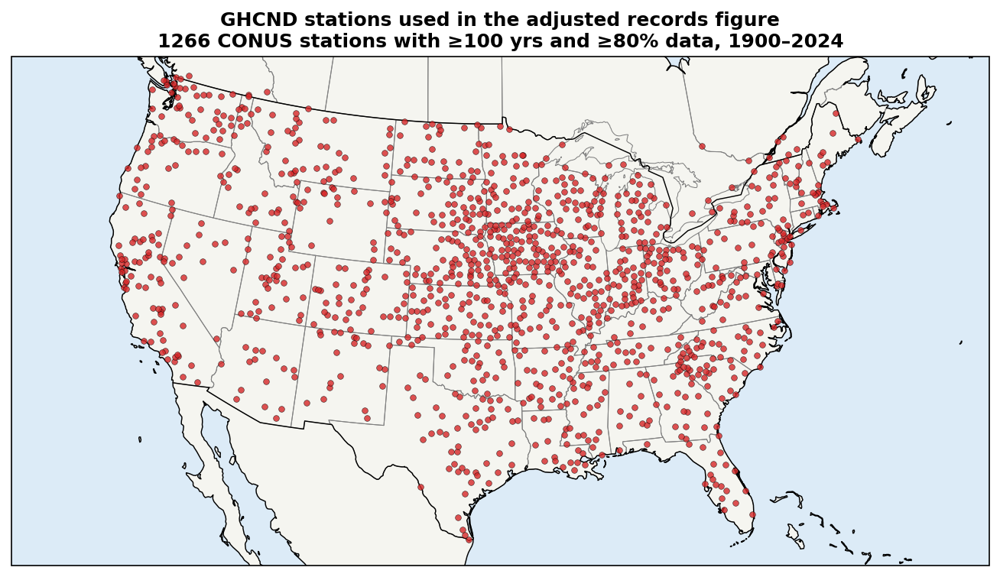
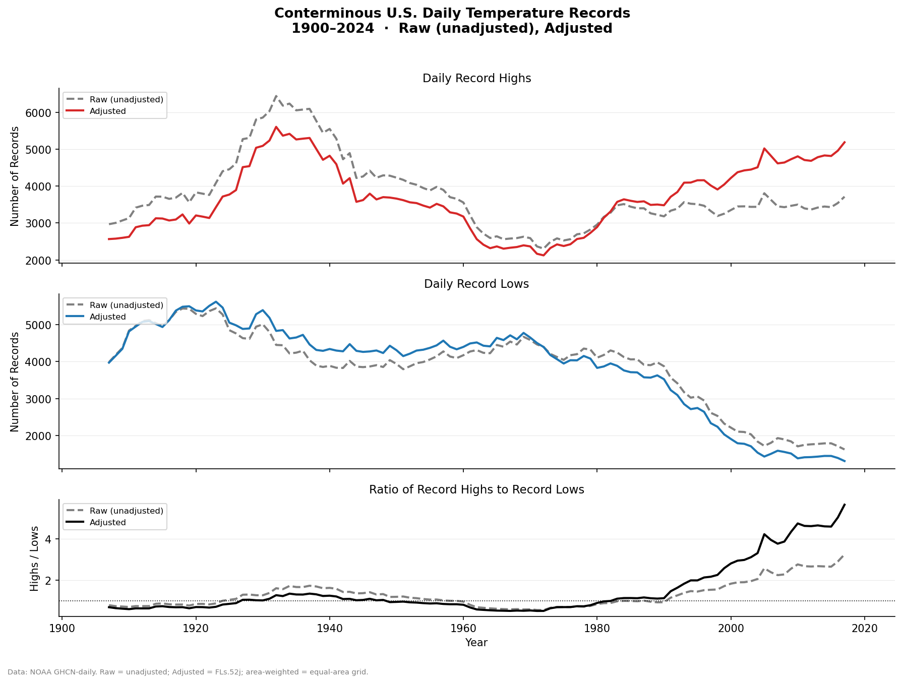
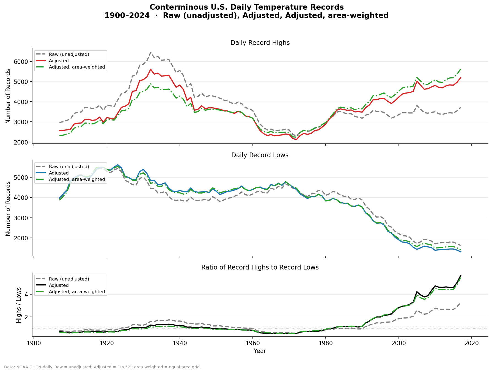
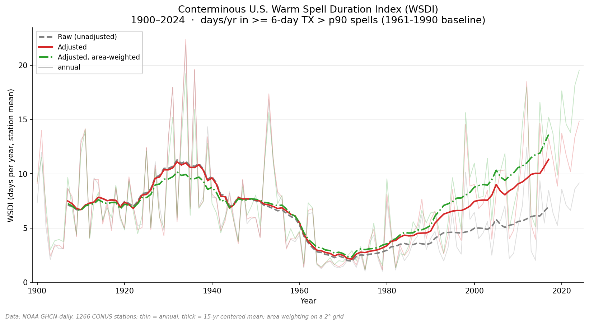

# U.S. Daily Temperature Records — Adjusted Data

Calculates time series of number of temperature records in CONUS using **homogeneity-adjusted** GHCN-daily data rather than raw observations.

## Data sources

| Data | Path |
|------|------|
| raw GHCN-daily observations (by year) | `https://www.ncei.noaa.gov/data/north-american-dataset/access/` |
| Monthly FLs.52j adjustment offsets | see below |
| Station metadata | Downloaded at runtime from NOAA NCEI |
| Berkeley Earth gridded TMAX (`Complete_TMAX_LatLong1.nc`) | [berkeleyearth.org/data](https://berkeleyearth.org/data/) — [direct download](https://berkeley-earth-temperature.s3.us-west-1.amazonaws.com/Global/Gridded/Complete_TMAX_LatLong1.nc) (~140 MB) |

The adjustment is derived from monthly data and applied as:

```
adjusted_temp = raw_temp_C + monthly_offset_C
```

where the same offset is applied to all days within a calendar month. The `monthly_offsets.nc` file is produced by a companion repository: [aedessler/GHCN-monthly-offsets](https://github.com/aedessler/GHCN-monthly-offsets).

## Station selection

- **CONUS only**: latitude 24.5–49.5°N, longitude −125 to −66°W
- **≥100 years** of TMAX and TMIN data within the 1900–2024 study period
- **≥80%** of all possible station-days have valid, unflagged observations

This yields **1,266 stations**. 

`plot_station_map.py` draws these stations over a color field of the **1930–1939 JJA (Jun–Aug) maximum-temperature anomaly** from the Berkeley Earth gridded TMAX product (relative to the 1951–1980 climatology), which shows the Dust Bowl heat over the central U.S. It also contains an optional **station-density vs. anomaly** scatter (`figures/density_vs_anomaly.png`), aggregated on a coarse CONUS grid and disabled by default behind the `RUN_DENSITY_SCATTER` flag.



## Record definition

For each station × calendar day-of-year pair, the year with the **highest adjusted TMAX** across all years receives one record high, and the year with the **lowest adjusted TMIN** receives one record low. **Ties are split fractionally**: if N years tie for a station–DOY record, each receives 1/N of a record, so every station–DOY pair contributes exactly one record total regardless of ties. The total number of records therefore equals the number of valid station–DOY pairs (identical for highs and lows), and the expected count in any given year ≈ (#stations × 365) / #years ≈ 3,700.

## Effect of the homogeneity adjustment

The adjustment is a first-order effect. It lowers the early-century records and increases the recent decades. With fractional tie-splitting, raw and adjusted have the *same* total number of records, so the two curves differ only in how records are distributed across years — the raw data places relatively more record highs in the early/mid 20th century, the adjusted data shifts them toward recent decades.



## Spatial weighting

The GHCN-daily network is much denser in the eastern U.S. than the west: 68% of the 1,266 stations lie east of 100°W, although the west is roughly half of CONUS by area. Because the main figure **sums** record-setting station-days nationally, the totals are weighted toward eastern climate.

`plot_records.py` re-aggregates the records on an equal-area grid (its `weighted` series) to remove this bias: each station is weighted by `cos(lat) / (stations in its 2° cell)`, normalized to mean 1, so every occupied grid cell contributes in proportion to its **area** rather than its station count.




## General comparison figure

`plot_records.py` is a single, flexible plotter that overlays **any subset** of the
three series — `raw`, `adjusted`, `weighted` (area-weighted adjusted) — on the
standard three-panel layout (record highs, record lows, and their ratio), each as
a centered running mean. All series are recomputed from the same checkpoint
memmaps and the same 1,266 stations, so any selection is mutually consistent. Only
`raw` touches the external offsets file, so selections without it run with no drive
mounted.

```bash
python plot_records.py                      # all three -> figures/records_raw_adj_wtd.png
python plot_records.py adjusted             # baseline only -> figures/records_adj.png
python plot_records.py raw adjusted         # adjusted vs raw
python plot_records.py adjusted weighted --csv data/cmp.csv   # also dump the series
```

The output filename defaults to `figures/records_<sel>.png`; `-o/--out` overrides
it, `--smooth` sets the running-mean window (default 15 yr) and `--grid` the
area-weight grid size (default 2°). Only `replot.py` (the single-series
main figure plus its CSV) is kept as a separate plotter.

## Warm Spell Duration Index (WSDI)

`plot_wsdi.py` computes the ETCCDI / [climpact](https://climpact-sci.org/indices/)
**Warm Spell Duration Index**. For each station it builds a calendar-day 90th-percentile
TMAX threshold from a 1961–1990 baseline — the percentile is taken over a centered
5-day window around each calendar day, so the threshold curve is smooth and
seasonally varying. Every day whose TMAX exceeds its own calendar-day threshold is
flagged "hot," and the WSDI counts the days that fall in runs of **≥6 consecutive**
hot days ("warm spells"): a 5-day run is ignored, a 6-day run counts, and a 10-day
run contributes all 10 days. The per-station annual totals are averaged across the
1,266 stations — equal-area weighted for the `weighted` series — to give a national
mean in days/year.

Like the records plotter, it overlays any subset of `raw` / `adjusted` / `weighted`:

```bash
python plot_wsdi.py                    # all three -> figures/wsdi_raw_adj_wtd.png
python plot_wsdi.py adjusted           # baseline only -> figures/wsdi_adj.png
python plot_wsdi.py adjusted --ref 1981 2010 --csv data/wsdi.csv
```

`--ref` sets the baseline period, `--pctile`/`--window`/`--min-run` the index
parameters, and `--smooth`/`--grid` behave as in `plot_records.py`. The same pattern
seen in the records emerges: the **raw** WSDI has essentially no trend — its
2010–2024 mean (~7 days/yr) matches the early 1900s, and its largest warm-spell
years are the 1930s Dust Bowl — while the FLs.52j adjustment roughly **doubles** the
recent WSDI (~11 days/yr adjusted, ~14 area-weighted). As with the records, the
recent warm-spell trend is introduced by the homogeneity adjustment rather than
present in the raw observations.



## Repository layout

Scripts live at the top level; their inputs and outputs are split into two folders the scripts create automatically:

- `data/` — checkpoints and caches (`.dat`, `.npz`) and result tables (`.csv`). Git-ignored and regenerable.
- `figures/` — all `.png` figures (tracked).

`helpers.py` is a shared module imported by the other scripts. It holds the
NOAA station-coordinate lookup (`fetch_station_coords` / `coords_for`, used for
the station map, the E/W density stats, and area weighting) and the raw-temperature
reconstruction (`reconstruct_raw`, used by `plot_records.py` to build the raw series).

## Usage

```bash
python compute_adjusted_records.py    # reads year files -> data/records_cache.npz (slow)
python replot.py                       # data/records_cache.npz -> figures/adjusted_records.png + data/adjusted_records.csv

python plot_station_map.py             # cartopy map of stations -> figures/station_map.png
python station_density.py              # E/W density stats -> data/good_stations.csv

# Flexible comparison overlays — pick any subset of raw / adjusted / weighted:
python plot_records.py raw adjusted weighted -o figures/areaweighted_vs_unweighted_records.png
python plot_records.py raw adjusted          -o figures/adjusted_vs_raw_records.png
python plot_records.py adjusted weighted     -o figures/adjusted_records_areaweighted.png

# Warm Spell Duration Index (same raw / adjusted / weighted selection):
python plot_wsdi.py raw adjusted weighted    # -> figures/wsdi_raw_adj_wtd.png
```

Requires: `numpy`, `pandas`, `xarray`, `matplotlib`, and `cartopy` (all in the Miniconda base environment).

`compute_adjusted_records.py` runs approximately 50–60 minutes, dominated by reading and filtering the compressed year files from the external drive. The remaining scripts run in seconds from the cached checkpoint memmaps (`plot_station_map.py` / `station_density.py` also download station metadata from NOAA NCEI).

`plot_records.py` recomputes every selected series in-memory from the checkpoints; the `raw` series removes the FLs.52j offsets, so it reads the offsets `.nc` (external drive) but not the year files and writes no separate raw cache. Selections without `raw` need no drive mounted.
